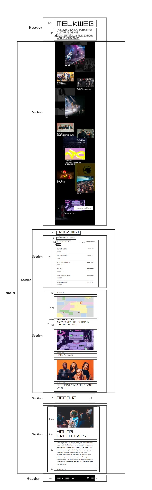
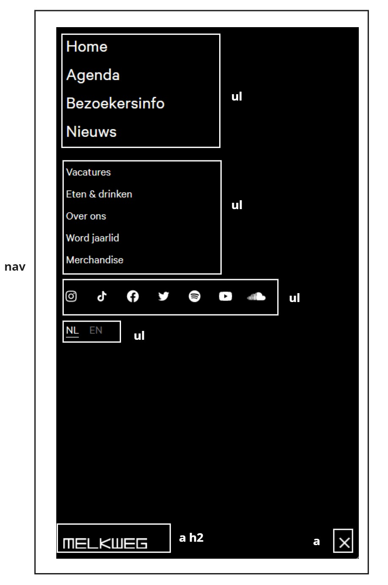
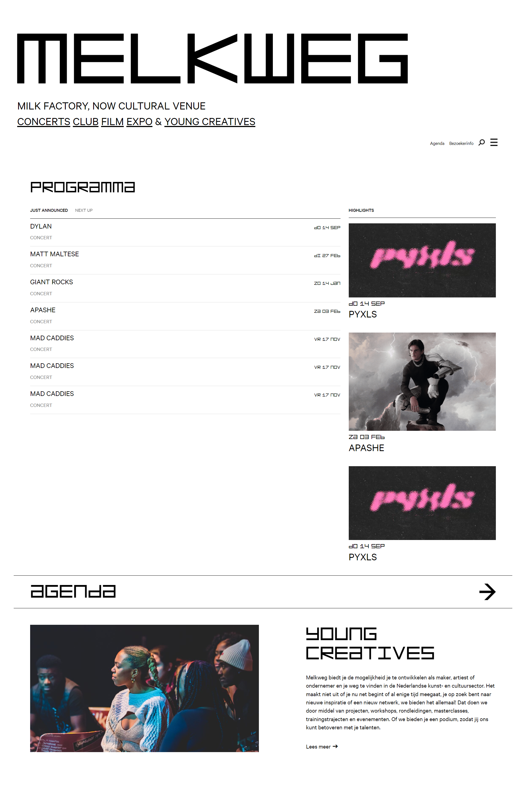
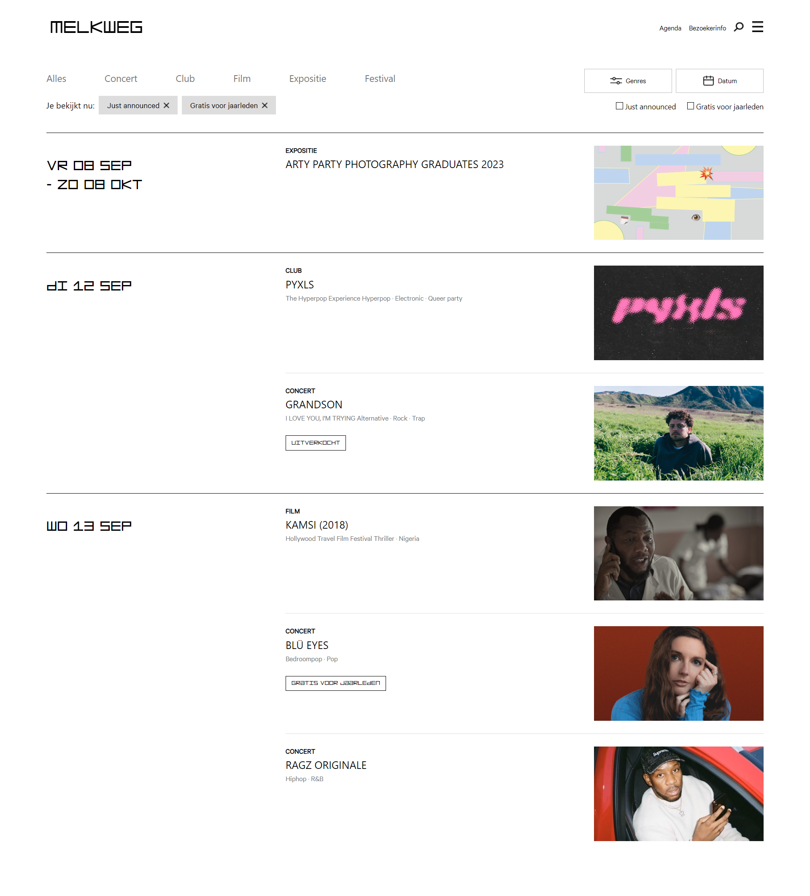
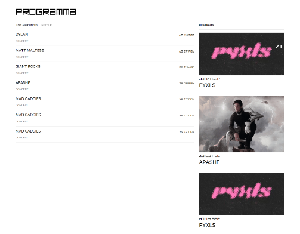
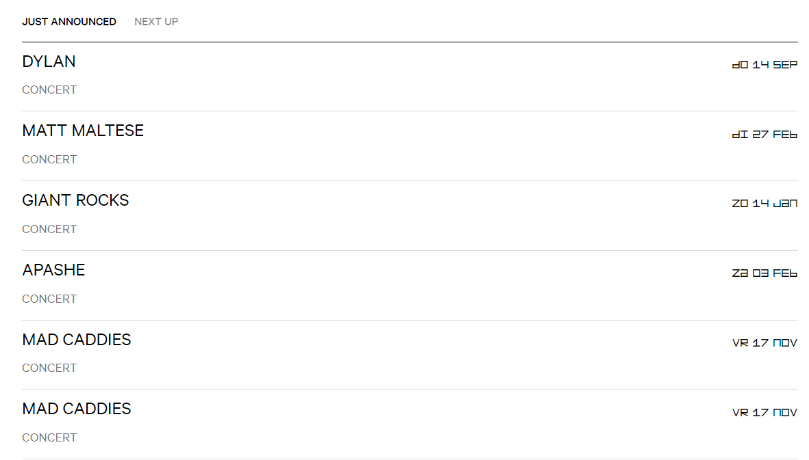
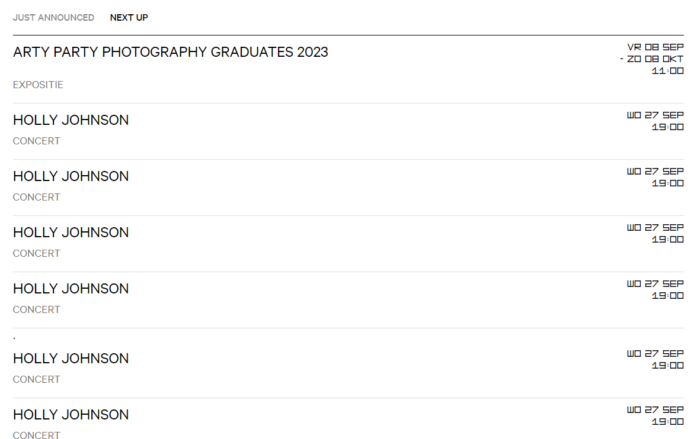
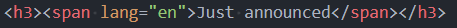
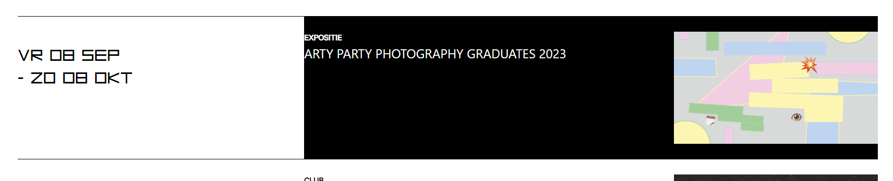
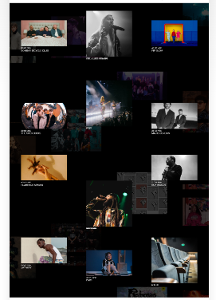

# Procesverslag
Markdown is een simpele manier om HTML te schrijven.  
Markdown cheat cheet: [Hulp bij het schrijven van Markdown](https://github.com/adam-p/markdown-here/wiki/Markdown-Cheatsheet).

Nb. De standaardstructuur en de spartaanse opmaak van de README.md zijn helemaal prima. Het gaat om de inhoud van je procesverslag. Besteedt de tijd voor pracht en praal aan je website.

Nb. Door *open* toe te voegen aan een *details* element kun je deze standaard open zetten. Fijn om dat steeds voor de relevante stuk(ken) te doen.

## Jij

  
uitwerken voor kick-off werkgroep

  ### Auteur:
  Joost Locher

  #### Je startniveau:
  Rood

  #### Je focus:
  Responsive
 

## Je website

  
uitwerken voor kick-off werkgroep

  ### Je opdracht:
  https://www.melkweg.nl/nl/

  #### Screenshot(s) van de eerste pagina (small screen): 
  Melkweg Home 
  

  #### Screenshot(s) van de tweede pagina (small screen):
  Melkweg Agenda  
  
 

## Toegankelijkheidstest 1/2 (week 1)

  
uitwerken na test in 2e werkgroep

  ### Bevindingen
  Lijst met je bevindingen die in de test naar voren kwamen:
  - lang staat op nl maar daardoor worden engelse worden die ze veel gebruiken in het nederlands voorgelezen.
  - lees meer link bevat geen alt die uitlegt wat er meer te lezen valt.
  - alle img bevatten een lege alt terwijl het best van toepassing kan zijn en niet alleen decoratief zijn.
  goede punten:
  - de website heeft een skip button heeft naar de content aan het begin van de website.
  - bewegende media hebben pauzeer knoppen.
  - er zijn goede focus states.

## Breakdownschets (week 1)

  
uitwerken na afloop 3e werkgroep

  ### de hele pagina: 
  

  ### dynamisch deel (bijv menu): 
  

## Voortgang 1 (week 2)

  
uitwerken voor 1e voortgang

  ### Stand van zaken
  hier dit ging goed & dit was lastig (neem ook screenshots op van delen van je website en code)

  ### Agenda voor meeting
  samen met je groepje opstellen

  student 1 Karlijn :
  - wanneer afbeelding in html en wanneer css?

  student 2 Annika :
  - hoe krijg ik mijn menu button met javascript werkend?

  student 3 Tygo :
  - werkt een aside laten uit en inschuiven hetzelfde als de menu opdracht?
  - hoe maak ik een dropdown menu die alle onderstaande content verder omlaag duwt?
  - hoe zorg ik ervoor dat ( checkbox ) filters zich daadwerkelijk toepassen op de artikelen die de website mij zal tonen?
  - hoe zorg ik dat het stuk tekst dat zegt hoeveel resultaten er gevonden zijn zich aanpast afhankelijk van het aantal resultaten?
  - hoe creeër ik "laagjes" waarmee elementen elkaar overlappen door middel van css?
  
  student 4 Joost :
  - mag een <.h2.> in een <.a.>?
  - wanneer svg en wanneer een button?
  - mag een <.ul.> in een <.ul.>?
  - wat zijn handige volgordes van <.img.> <.p.> <.h2.> enz.?

  ### Verslag van meeting
  hier na afloop snel de uitkomsten van de meeting vastleggen

  - punt 1
  - punt 2
  - nog een punt
  - ...

## Voortgang 2 (week 3)

  
uitwerken voor 2e voortgang

  ### Stand van zaken
  hier dit ging goed & dit was lastig (neem ook screenshots op van delen van je website en code)

  ### Agenda voor meeting
  samen met je groepje opstellen

  student 1 Karlijn :

  student 2 Annika :

  student 3 Tygo :

  student 4 Joost :

  ### Verslag van meeting
  hier na afloop snel de uitkomsten van de meeting vastleggen

  - punt 1
  - punt 2
  - nog een punt
- ...

## Toegankelijkheidstest 2/2 (week 4)

  
uitwerken na test in 9e werkgroep

  ### Bevindingen
  Lijst met je bevindingen die in de test naar voren kwamen (geef ook aan wat er verbeterd is):
  - sommige img missen een alt.
  - engelse woorden worden nog uitgespeld in het nederlands.
  - geen skip link naar content aanweezig
  - sommige delen hebben nog geen duidelijke focus state

  Verbeterd:
  - Engelse woorden hebben nu span met lang = en
  - Lees meer heeft aria label
  - Alle img en icons hebben een alt of aria label

## Voortgang 3 (week 4)

  
uitwerken voor 3e voortgang

  ### Stand van zaken
  hier dit ging goed & dit was lastig (neem ook screenshots op van delen van je website en code)

  ### Agenda voor meeting
  student 1 Karlijn :

  student 2 Annika :

  student 3 Tygo :

  student 4 Joost :

  ### Verslag van meeting
  hier na afloop snel de uitkomsten van de meeting vastleggen

  - punt 1
  - punt 2
  - nog een punt
  - ...

## Eindgesprek (week 5)

  
uitwerken voor eindgesprek

  ### Je uitkomst - karakteristiek screenshots:
  homepage
  

  agenda
  

  ### Dit ging goed/Heb ik geleerd: 
  
  - Het responsive maken van de programma sectie waarbij ze naast elkaar komen te staan op groter scherm.
  
  

  - Het wisselen van lijst die zichtbaar is met javascript was ook goed gelukt.
  
  

  - Het gebruiken van span om taal voor een bepaald deel te veranderen.
  

  ### Dit was lastig/Is niet gelukt:
  - Het is mij niet gelukt om de hele breedte van de pagina zwart te krijgen wanneer er overheen wordt gehoverd.
  

  - Ook had ik geen tijd meer voor het maken van de volgende sectie op de afbeelding hieronder. Maar had dit nog wel graag willen doen.
  

## Bronnenlijst

  
bronnen

  1. https://www.w3schools.com/
  2. https://chat.openai.com/
  3. https://developer.mozilla.org/en-US/
  4. icons | https://svgexport.io/

